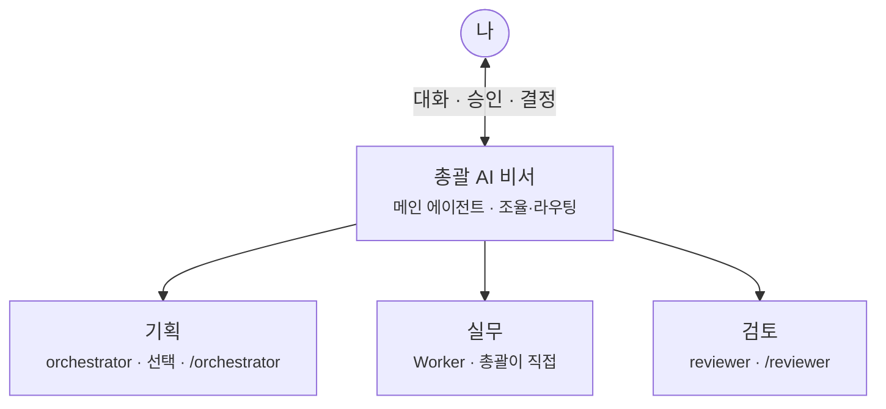
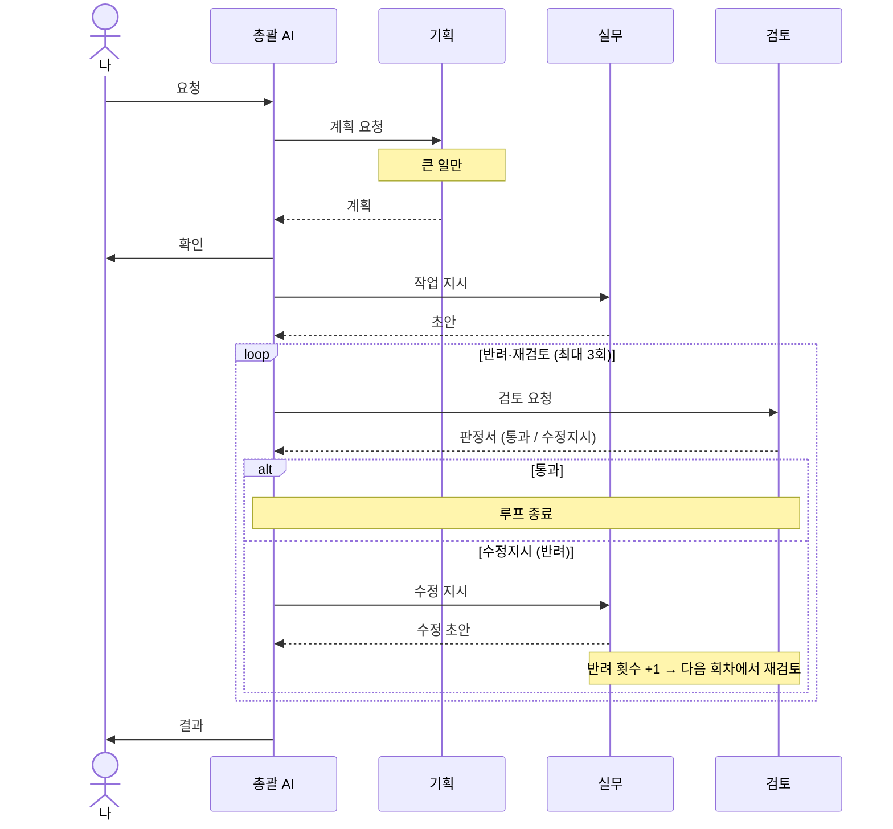

# 에이전트 시스템 개요

> repo에 구현된 지침 세트가 **실제로 어떻게 동작하는지** 설명한다.
> 세부 규약은 [`agent-thinking-guidelines.md`](agent-thinking-guidelines.md)(기본 지침)과 [`multi-agent-orchestration.md`](multi-agent-orchestration.md)(멀티에이전트 확장)을 참조한다.

---

## 1. 한 줄 요약

**나는 총괄 AI 비서와만 대화한다.** 큰 일은 계획을 먼저 보고 승인하고, 결과는 검토 담당이 확인한 뒤 전달된다.

---

## 2. 구조

| 쉬운 말 | 기술 용어 | 비고 |
|---|---|---|
| 총괄 AI 비서 | 메인 에이전트 | Worker 호출·상태 추적·에스컬레이션도 담당 |
| 기획 | orchestrator | 플래너 — 분해·라우팅 **계획만** 반환 |
| 실무 | Worker | 메인 에이전트가 겸함 |
| 검토 | reviewer | 산출물만 받아 체크리스트 판정 |

**구현상 핵심:** 역할은 여러 개지만, 서브에이전트를 실제로 호출·라우팅하는 주체는 항상 **메인 에이전트**다. orchestrator는 산출물을 만들거나 reviewer를 대신 호출하지 않는다. (이유·제약은 [`multi-agent-orchestration.md` 1장](multi-agent-orchestration.md#1-구조-개요))

---

## 3. 흐름

위에서 아래로 **시간 순서**다. 화살표는 **누가 누구에게** 무엇을 넘기는지다.

루프는 **반려(수정지시) 횟수**를 센다. Worker가 고치는 횟수가 아니라, 검토에서 `수정지시`가 나온 횟수가 최대 3회다. 같은 사유가 2회 연속 반려되면 3회를 기다리지 않고 즉시 중단한다. 막히면 총괄 AI가 나에게 선택지를 보고한다. (종료 조건·에스컬레이션 형식은 [`multi-agent-orchestration.md` 3·7장](multi-agent-orchestration.md))

역할 간 메시지는 자유 서술이 아니라 **정해진 형식**(작업 지시서 / 산출물 제출서 / 판정서)을 따른다. 상세 필드는 [`multi-agent-orchestration.md` 2장](multi-agent-orchestration.md#2-공통-통신-규약).

---

## 4. 지침 계층과 운용 모드

repo는 Cursor·Claude Code 두 버전으로 매핑되어 있으며, 역할 구조는 동일하다.

| 계층 | Cursor | Claude Code | 적용 (기본 = 옵트인) |
|---|---|---|---|
| **기본 원칙** | `core-principles.mdc` | `CLAUDE.always.md` (스텁은 `CLAUDE.md`) | `@docs/agent-thinking-guidelines.md` 또는 항상 적용 전환 후 |
| **작업 규율** | `worker-conduct.mdc` | 위와 동일 | 동일 |
| **상황별 프로토콜** | `skills/analysis-protocol`, `skills/design-protocol` | 동일 경로 | 해당 작업·명시 호출 시 |
| **플래너** | `agents/orchestrator.md` | `agents/orchestrator.md` | `/orchestrator` |
| **승인자** | `agents/reviewer.md` | `agents/reviewer.md` | `/reviewer` |
| **세션 간 기억** | `.cursor/memory/` | `.claude/memory/` | 수동 참조 |
| **루프 상태** | `.cursor/state/loop-status.md` | `.claude/state/loop-status.md` | 루프 실행 시 |

기본 설치는 **호출 시에만** 지침을 켠다(토큰 절약). 설치 완료 시 에이전트가 호출법을 안내하고 **"항상 적용되도록 적용할까요?"** 를 묻는다.

| 모드 | 구성 | 적합한 작업 |
|---|---|---|
| **일상 (옵트인 끔)** | 메인 에이전트만 | 가벼운 질문·소규모 수정 |
| **지침 켜기** | `@docs/…` + 메인 | 설계·분석·규율이 필요한 작업 |
| **검증** | + `/reviewer` | 수치 보고, 되돌리기 어려운 변경 |
| **풀 루프** | + `/orchestrator` + state | 대규모 리팩터링, 다단계 설계 |
| **항상 적용** | Cursor `alwaysApply: true` / Claude `CLAUDE.always.md`→`CLAUDE.md` | 토큰 비용을 감수하고 매 세션 자동 적용 |

도입은 단계적으로 권장한다: **(1)** 메인 + reviewer → **(2)** 체크리스트 보정 → **(3)** orchestrator 추가. 처음부터 3-에이전트를 완전 자동으로 켜면 어느 층에서 문제가 생겼는지 진단하기 어렵다. ([`multi-agent-orchestration.md` 9장](multi-agent-orchestration.md#9-도입-순서-권장))

---

## 5. 세션 간 연속성

| 저장소 | 용도 | 핵심 규칙 |
|---|---|---|
| `memory/` | 프로젝트별 교훈 축적 | 한 교훈 = 한 파일, `요약:` 한 줄로 스캔, `docs/` 지침이 우선 |
| `state/loop-status.md` | 루프 작업 상태·반려 횟수 | 매 판정 후 즉시 갱신, 세션 재개 시 컨텍스트보다 파일을 먼저 읽음 |

상태 값: `대기` / `진행` / `검토중` / `반려(n회)` / `통과` / `에스컬레이션`

파일 규칙·부트스트랩은 [`agent-thinking-guidelines.md` 8장](agent-thinking-guidelines.md#8-세션-간-기억-메모리), 루프 상태 관리는 [`multi-agent-orchestration.md` 3.4절](multi-agent-orchestration.md#34-상태-관리)을 참조한다.

---

## 6. 문서 맵

| 읽고 싶은 것 | 문서 |
|---|---|
| 에이전트가 어떻게 **생각·판단**해야 하는지 | [`agent-thinking-guidelines.md`](agent-thinking-guidelines.md) |
| 멀티에이전트 **규약·메시지 형식·역할 지침** | [`multi-agent-orchestration.md`](multi-agent-orchestration.md) |
| **전체 동작 흐름** (이 문서) | `agent-system-overview.md` |
| Cursor 설치·프롬프트 템플릿 | [`../cursor/README.md`](../cursor/README.md) |
| Claude Code 설치·프롬프트 템플릿 | [`../claude/README.md`](../claude/README.md) |

---

## 7. 알려진 한계

- 지침은 행동 패턴을 교정하지만 **모델의 판단 능력 자체**를 올리지는 못한다.
- reviewer와 Worker가 같은 모델이면 맹점을 공유할 수 있다. 통과된 산출물도 주기적으로 사람이 샘플 검수해야 한다.
- 되돌리기 어려운 작업(DB 변경, 외부 전달물)은 지침·reviewer와 무관하게 **사람이 최종 확인**한다.
